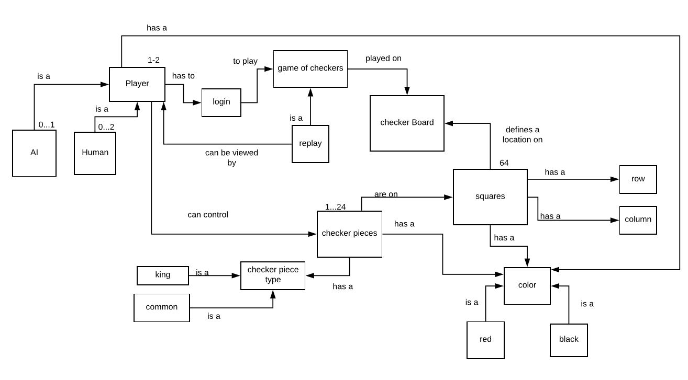
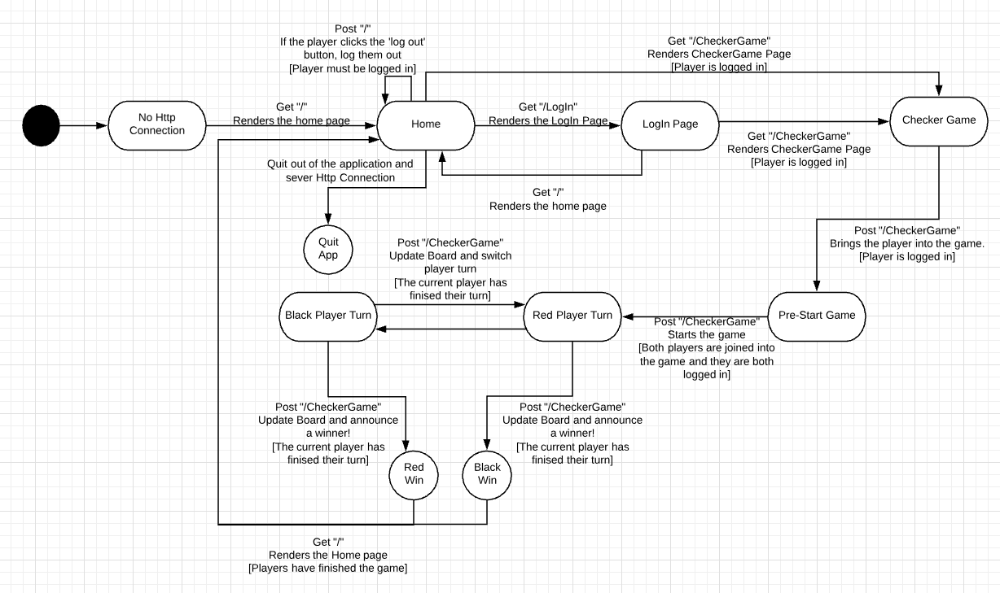
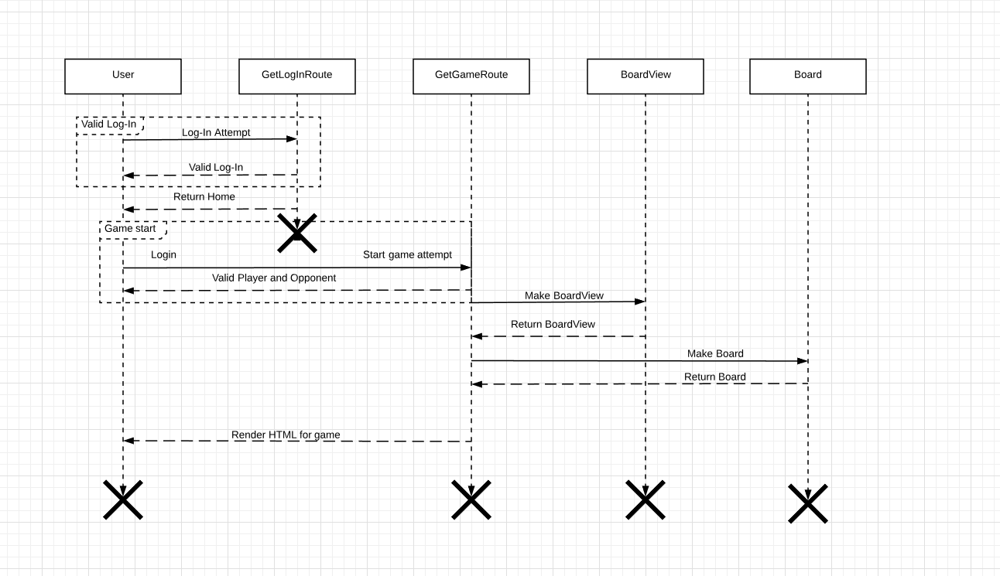
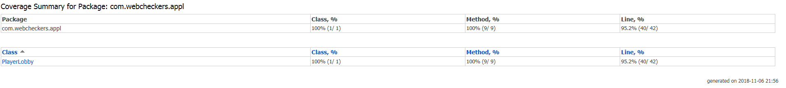
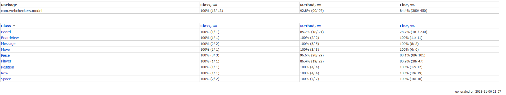
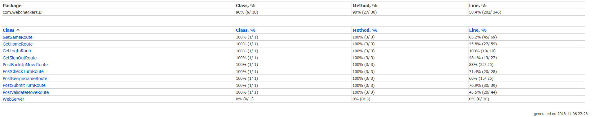

# Web Checkers Application Design Documentation

## Team Information
* Team name: GuineaPigs
* Team members
  * Edward Herrin
  * Jisook Moon
  * Jack Xu
  * Xavier Brooks
  * David Malik

## Executive Summary
> _This product is a client/server product that allows people to play online checkers. 'WebCheckers' is
> a fun, easy platform for all to use. Once the server is started, players can join and log into the server.
> Once logged in, the players can challenge one another to the game and their clients will link them together
> to the server. Players can then play the game or resign at anytime._

### Purpose
> _The web based checker game logic is written in Java and it utilizes Spark Framework along with
> Template engine to render the graphics for the user. The user group of this project are checker
> players who wants to play a game of Checker online. The player will initially a log in page after they
> accessed the server address. Afterwards, the player have the options of challenging other players by
> clicking on their name. If the other player is available, the game will begin and the gameboard will be rendered.
> The game will switch between players and allow players to make moves consistent with American Checkers rule._

### Glossary and Acronyms

| Term | Definition |
|------|------------|
| POJO    | Plain Old Java Object   |
| PO      | Position                |
| AI      | Artificial Intelligence |
| UI      | User Interface          |
| Forfeit | Rage quit               |
| MVP     | Minimum Value Product   |
| HTTP    | Hyper Text Transfer Protocol  |
| HTML    | Hypertext Markup Language  |

## Requirements

* Player Sign-In/Sign-Out
    * A player must sign in with an alias that is not taken.
    * Once signed in, a player can choose an available online opponent in the lobby.
    * If chosen to play by an opponent, the game automatically starts.
    * A player can signout by pressing the sign out button or simply closing their browser (rage-quit)

* Game play
    * All valid moves correspond with the American rules of checkers
    * During the game, any player can end the game by forfeiting
    * Moving pieces can be dragged and dropped in a valid position chosen by the player
    * Running out of possible moves also qualifies as losing the game

* AI Player
    * There will be an option to play against an AI player
    * The AI player can play against multiple players at once
    * There will be a basic AI (easy mode) and a smart AI (hard mode)

* Player Help
    * This feature will allow players to see current valid moves for a certain piece

* Spectator Mode
    * There will be an option to 'spectate' or watch a current ongoing game

### Definition of MVP
* For our sprint second, we strive to implement the minimal features such as simple moves, single jump moves and forfeit.
* Single moves should allow the user to move one space diagonally and validate that move.
* Single jump moves should allow the user to jump over one enemy piece provided that there is an empty space behind the enemy piece.
* Single jump move should also be able to check if the move the player tried to make is valid.
* The forfeit feature allows the user to concede a game and end the game, allowing the opponent to win.

### MVP Features
> _As a user I would like to be able to take a turn so that I am one step closer to winning the game while adhering to the rules
>  as a user i would like to be able to Jump over an enemy piece that is in te immediate diagonal black squareso that I can remove It
>  As a player I would like to be able to move my piece to teh next immediate black diagonal square so that i can progress the game_

### Roadmap of Enhancements
* Roadmap of Enhancement
    * Player Help
        * this feature will allow the user to click on one piece and see all the moves currently available for that piece
        * the available moves will be highlighted on the board
    * Spectator Mode
        * this feature will allow another user to spectate a game that is being played
        * there should be a menu in the main page to show games in play
        * it will allow users to play back their games

## Application Domain

>_Figure 1 depicts the domain model and contains the many components that helps the web checker app perform. The domain model
consists of arrows that run between different units which describe the relationship between units and the quantity of which
are created during game play. For example, the Player unit is connected to the login unit by an arrow labeled 'has to'
which expresses the process that a player must login prior to game play. The quantities above the Player unit expresses the 
idea that one or two players can play a game of checkers where the opponent can either be another human player or a computer._

> _The web checkers application consists of multiple components which all interact with one another. The overall application
> is split under two major sections - UI and MODEL. The MODEL handles game data and the frontend part of the game is
> controlled by the UI components._

> _The MODEL creates the following Board, BoardView, Piece, Player, Row, and Space. These listed classes create essential
> components of the web checkers game application. A board is made up of rows, which consists of spaces. Players represent
> the types of places a Piece can be, and a Piece represents game piece on the checkerboard._

> _The UI is made up of different classes that handle requests and responses for the web checkers application. This allows
> the game to have functions such as logging in a player, storing player data (such as username), current game wins,
> and gives users the ability to make game play moves or even forfeit the game!_

## Architecture and Design

This section describes the application architecture.

### Summary

The following Tiers/Layers model shows a high-level view of the webapp's architecture.

As a web application, the user interacts with the system using a
browser.  The client-side of the UI is composed of HTML pages with
some minimal CSS for styling the page.  There is also some JavaScript
that has been provided to the team by the architect.

The server-side tiers include the UI Tier that is composed of UI Controllers and Views.
Controllers are built using the Spark framework and View are built using the FreeMarker framework.  The Application and Model tiers are built using plain-old Java objects (POJOs).

Details of the components within these tiers are supplied below.

### Overview of User Interface

This section describes the web interface flow; this is how the user views and interacts
with the WebCheckers application.

The first page that a user will see is the "Web Checkers" splash screen where
they will have the option to sign in. Also, on this page is the number of players 
that are currently signed on and a welcome message. After the user clicks on the
"sign in" link on this page, they are taken to the sign in page where they are
prompted to enter a username. Once they have typed in a username and click on the 
submit button below it, they are taken to a page where they can view the names
of the currently signed players and challenge them to a game of checkers if they wish.
When the user decides to challenge a particular player, they will select their name
from a dropdown box and click on the challenge button. At this point the user will
be able to make a move and submit it, undo a previous move, or resign from the game
from the primary options. As well, at the top of the page remains the two secondary
options to either go back to the homepage or to sign out (which brings them to the 
splash page).

### UI Tier

>_The UI Tier is responsible for the movement of the player from screen to screen
> during their use of the WebCheckers application. It starts when the player opens
> the application on the browser and the GetHomeRoute is used. This will bring the
> the player to our landing page. Once there, they can click the LOG IN button to move
> to our GetLogInRoute page, where they can log in. Once logged in the will be returned
> to the home page._

> _Now that the user is logged into our game, they can challenge others to a game. If
> they do so, they player that did the challenging and the player getting challenged are
> both forcibly ripped into the game. The challenger uses the GetGameRoute to move to the page.
> While the challenged player won't use this route call until later to join the game,
> they will still see the game and the moment they make a move, the GetGameRoute will be called on them._

> _Once both players are in the game, they will take turns and play the game of checkers.
> This is where the AJAX routes get called. First, the PostCheckTurnRoute is called to see
> if it is a player's turn. This call is hidden from the player and is constatly waiting to see
> if it is the player's turn or not. If it is not a player's turn, then the only thing they can do is
> resign. If it is the player's turn they can move a piece and try to take a turn. If the player
> moves a piece, it will call the PostValidateMoveRoute. This will check if a move is valid.
> If the move is valid, the player can submit their turn or 'back up' and undo that move if they
> wish to make a different move. If the move is invalid, an error message is displayed and the player
> will have to move a different piece._

> _After a move is validated, the user can back up or submit their turn. We will start with if the user
> chooses to back up. This will return the piece that the user moved to it's original position.
> Afterwards, the player can choose to move another piece or the same piece. If the user chooses to submit
> their turn, the PostSubmitTurnRoute is called. This will update the board for both players of the current
> player's movement. It will then switch whose turn it is as well as cause both players to call the
> GetGameRoute, effectively refreshing the game and the board with the update board._

>_The last AJAX route is the resign route. At any point in time, the player can choose to resign from the
> game. If this happens, the PostResignGameRoute is called. This allows the player to leave the game, update
> their opponent and then returns them to the home page using the GetHomeRoute. They can then immediately join
> a new game._

> _The last route in the UI Tier is the GetSignOutRoute. At any point in time, the user can click a SIGN OUT button
> to sign out of the WebCheckers service. If they do this, it will call the GetSignOutRoute and remove them from
> the server. If the user is currently in a game, it will cause them to resign and then signs them out._

> _This diagram shows the process of a player logging in and then joining a game. First, the user uses the GetHomeRoute
to connect to the game (not shown in this diagram). Afterwards, they will use the GetLogInRoute in order to try to log in.
They will be kept in a loop until they give up logging in or they log in correctly and validly. Afterwards,
they can use the GetGameRoute to connect to another logged in player. They can keep making attempts to connect
until a player that is not currently in a game is selected and connected to. Afterwards, the GetGameRoute will create
the BoardView, and then use it and the current players to create a board. Afterwards it will render the HTML
for the game, displaying the board and the two players._
### Application Tier
> _The application Tier is responsible for handling the PlayerLobby which appears at the start page of the webcheckers app.
> The playerLobby object is responsible for keeping track of the players using the webcheckers app in a list. These
> responsibilities are managed using variious methods that manage these tasks. methods include getPlayernumber, GetPlayername,
> is available (determines if a name is free to use), addplayer, and remove player._

### Model Tier
> _The model Tier of the checkers webapp consists of various classes required to handle an instance of the game. These
> classes include of Space, Row, Piece, Boardview, Board, and player. Objects of the same name are constructed in each
> class in order to create data and instances of the objects to be modified in the board by the player during gameplay.
> These modifications result in the changes observed in browser during gameplay as a result of interaction between the UI
> and ModelTiers._

> _The Space and Row classes create individual spaces and rows objects for the board. These objects are used to allow
> players, represented by player objects, to make moves with piece objects. A move is presented by changing the space
> and row in browser as a player clicks and drags it along the board to a new location. The boardview class creates a
> boardd without any variation in color. The boardview is solely responsible for applying the location(spaces and rows
> to a board prior to a game starting).Once a boardview is created the boardview object is passed into the constructor
> of board in order to add players, to the boardview of opposing colors and creates adds pieces for the player to use
> throughout gameplay._

### Design Improvements
> _Throughout this coding experience we found the handling of checking for moves and jumping to be quite extreme. The
> main source of this problem is the fact that players are working in reverse order of one another. In order to
> compensate for this a forward and backward moving method was created which can be used for a king, both players and
> jumping. Much of the code created is checks for movement and the written code can be revised by writing methods for
> snippets of code that reoccur consistently and is something to be considered in the future._

## Testing
> _This section will provide information about the testing performed
> and the results of the testing._

### Acceptance Testing
>_ALl of the acceptance criteria have been tested and have passed all tests. Some of them 
were very challenging and produced a host of issues. One of the most annoying acceptance criteria to meet 
was one that forced the player to make a multiple jump move if one is available. Originally we allowed the player
to make part of the multiple jump move but did not force them to make all of the jumps. Thanks to thorough testing, 
we caught and fixed this error._

### Unit Testing and Code Coverage
>_Unit testing went as planned. We divided up the classes and all of the tiers amongst the group members. Everyone 
succeeded in creating unit tests for their classes with some hiccups. We set a goal to try and get roughly 90 percent 
of code coverage for the entire application. We succeeded in this goal for the application and model tiers. However, we had 
an anomaly when it came to the UI tier. The techniques we used to create unite tests for the free marker/HTML routes did not work 
 for the ajax routes. This caused us to have very little unit testing for those routes. Instead of unit testing, we had our testers 
 run the program using only one ajax route at a time and thoroughly testing every functionality of those routes. Although they 
 lacked proper unit tests, we are confident that they work properly and effectively._

